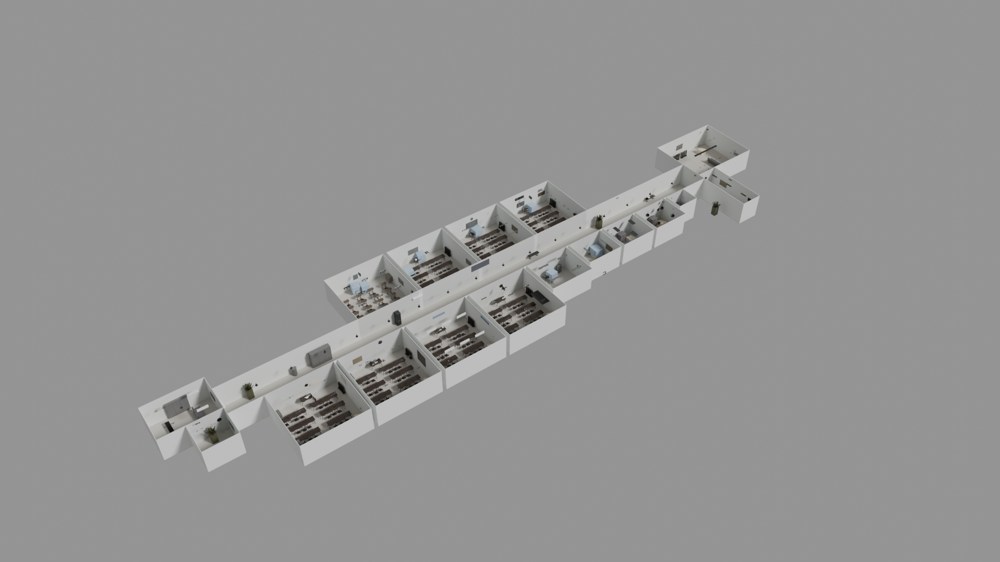
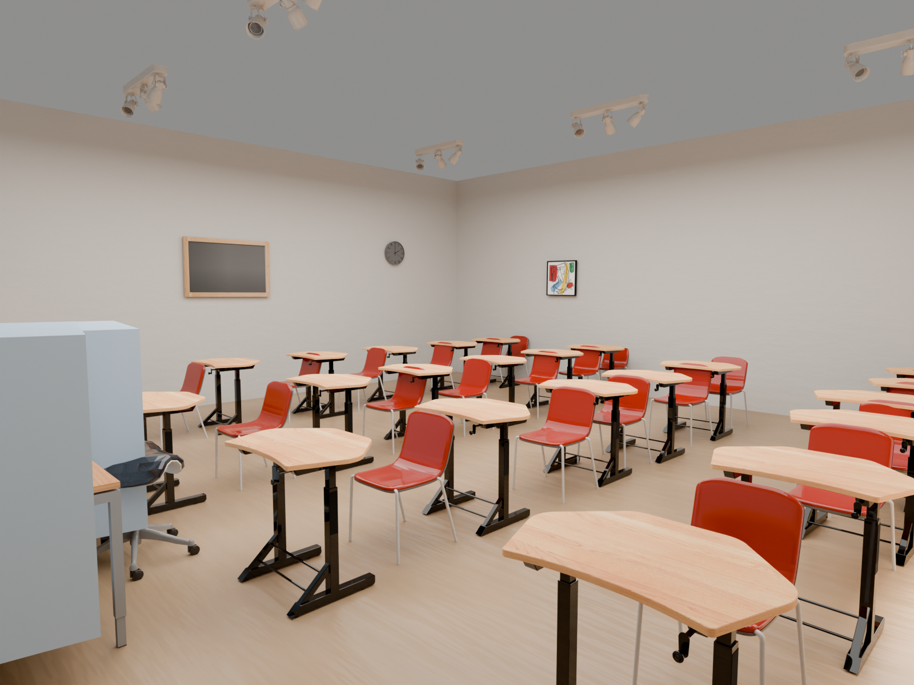

# Humanoid-Training Scene-Ready Generation

Tooling for generating **simulation-ready multi-room scenes** for robot /
humanoid training, built as an automation, benchmarking, and quality-gate
layer on top of [SceneSmith](https://github.com/nepfaff/scenesmith)
(Nicholas Pfaff, MIT license), running on an HPC cluster (ParaCloud, SLURM)
with OpenAI Codex as the scene-reasoning backend.

This repository contains **only my own layer**: none of the upstream
SceneSmith source is copied here. My modifications to upstream files are
published as reviewable diffs under [`upstream-patches/`](upstream-patches/),
and my standalone tools live in their own directories. To reproduce a full
working checkout, clone upstream SceneSmith, apply the patches, and overlay
these files.

## What's here

| Directory | Contents |
|---|---|
| `CODEX_SCENESMITH_FULL_QUALITY_PIPELINE.md` | The 15-stage pipeline contract: asset policy, articulated-router validation, room self-exam gate, gated assembly, export validation |
| `scripts/` | Room-level quality gate (`room_self_exam.py`), articulated router validation, gated final assembly, parametrized per-room SLURM worker, review-view renderer |
| `tools/codex_benchmark/` | Benchmark suite measuring Codex CLI as a VLM/agent backend: latency, success rate, usage-limit handling, checkpointed resume |
| `tools/local_render/` | Headless Blender Cycles renderer for exported scenes on a 16 GB laptop: per-room isolation, memory-safe whole-floor renders, archviz shell materials |
| `remote_jobs/` | SLURM job templates with GPU-node API-proxy preflights and fail-fast guards |
| `local_setup/` | Environment bootstrap, dependency checks, Drake scene viewing, GLB export |
| `tests/` | Unit tests for the scene checker, benchmark money-guard, and report generation |
| `upstream-patches/` | My changes to upstream SceneSmith files, as reviewable diffs |
| `REFACTOR_PLAN.md` | Current refactor priorities and guardrails for keeping the repo maintainable |
| `DEVELOPMENT.md` | Local validation commands for tests, scene checks, benchmarks, and rendering |

## Key engineering problems solved

- **Silent asset-policy override**: generation runs silently fell back to
  retrieval-only assets. Fixed with a `--config-only` resolved-config check
  that fails the job if any agent's asset source doesn't match the requested
  pipeline.
- **Quality gating**: renders alone don't block bad rooms. Added a per-room
  pass/fail JSON gate (placement, clearance, collision risk, prompt
  alignment) that final assembly enforces.
- **HPC networking**: compute nodes have no internet; API access goes through
  a cluster-facing login-node proxy, with preflight probes inside every GPU
  allocation so jobs fail fast instead of stalling mid-run.
- **Simulator-ready export**: uncapped convex decomposition produced scenes
  Drake could not load at any memory size; collision hulls are now capped
  per object and validated end-to-end.
- **Consumer-hardware rendering**: a 1.4 GB exported house with 1,300+
  packed textures crashes Blender on a 16 GB laptop; the local renderer
  isolates rooms, caps texture decode, and bakes average colors for
  whole-floor shots to stay inside RAM/VRAM.

## Renders

Example output from a full 18-room school-floor generation run
(rendered with `tools/local_render/` on a laptop RTX 4060):

## Attribution

Scene generation is by [SceneSmith](https://github.com/nepfaff/scenesmith)
(MIT license). This repo is my orchestration, evaluation, rendering, and
quality layer around it; my working fork with the full integrated history is
[JIMMY081105/Scenesmith](https://github.com/JIMMY081105/Scenesmith).
